# green-api-custom-notifier

[green-api](https://green-api.com/en) is a service that allows us to send and receive text, photo and video using stable WhatsApp API gateway. The service includes free account that can be used to send notifications to 3 chats (Group or Private) and many more.


[green-api-custom-notifier](https://github.com/t0mer/green-api-custom-notifier) is a [Homeassistant ](https://www.home-assistant.io/) custom notification component that enables us to send notification to Whatsapp groups using [green-api](https://green-api.com/en).


## Limitations
* The free account is limited to 3 chats (Group or Private).


## Getting started

### Setup Green API account
Nevigate to [https://green-api.com/en](https://green-api.com/en) and register for a new account:
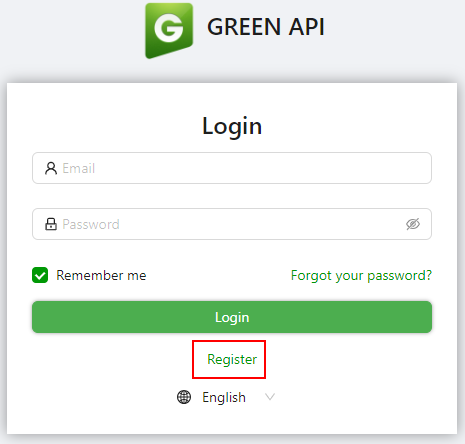

Fill up your details and click on **Register**:
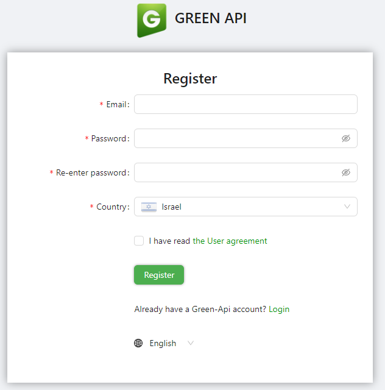


Next, click on the "Create an instance":
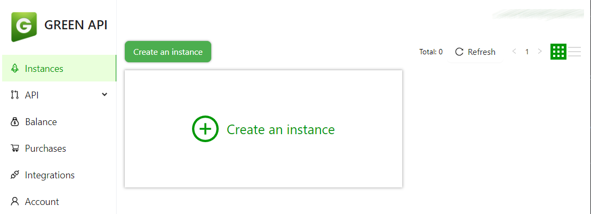


Select the "Developer" instance (Free):
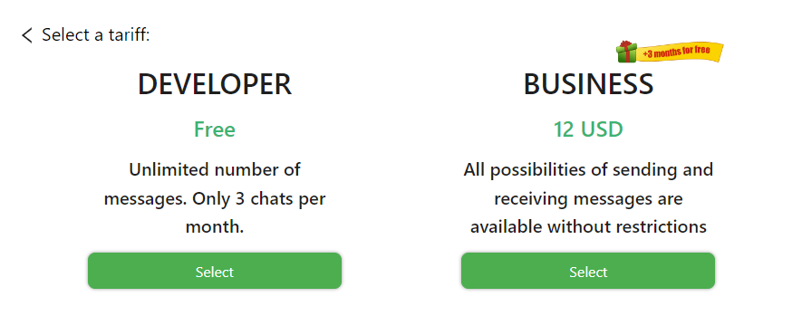


Copy the InstanceId and Token, we need it for the integration settings:
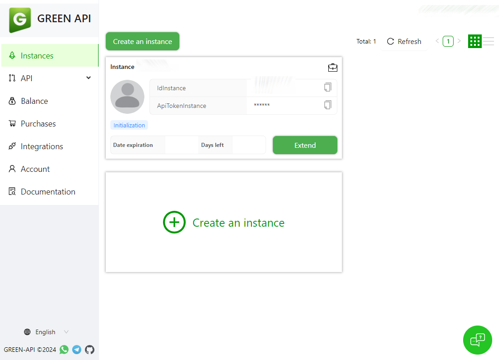

Next, Lets connect our whatsapp with green-api. On the left side, Under API --> Account, click on QR and copy the QR URL to the browser and click on "Scan QR code"

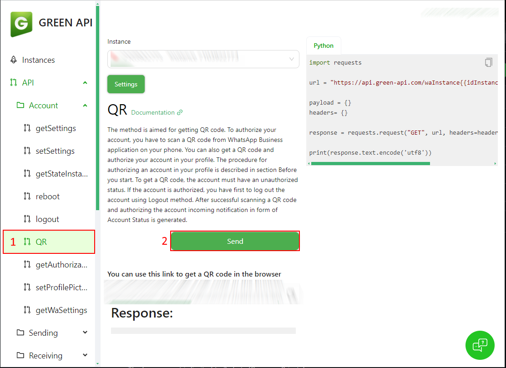

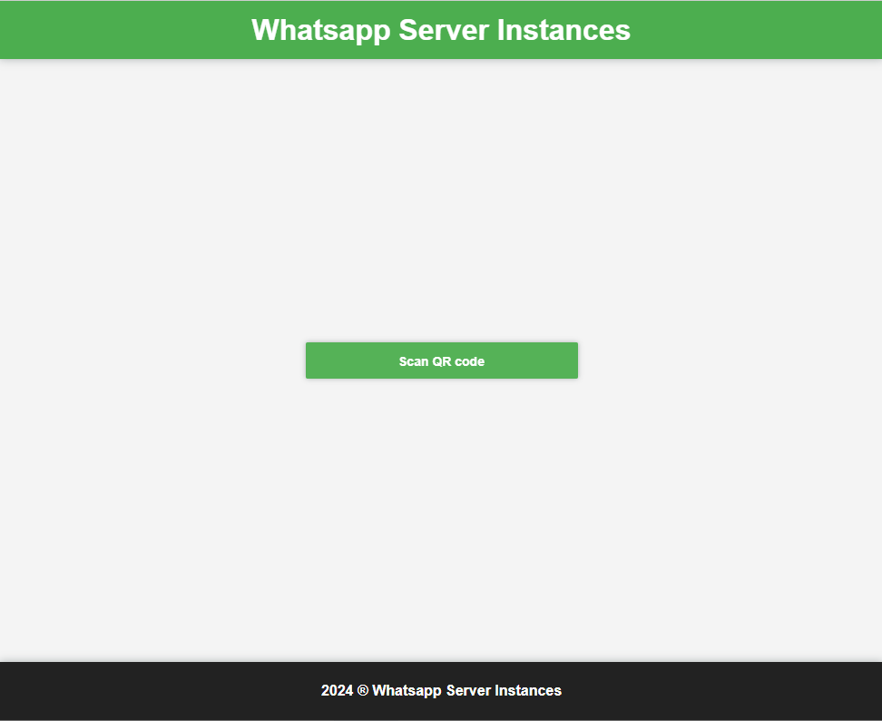

Next, Scan the QR code to link you whatsapp with Green API:

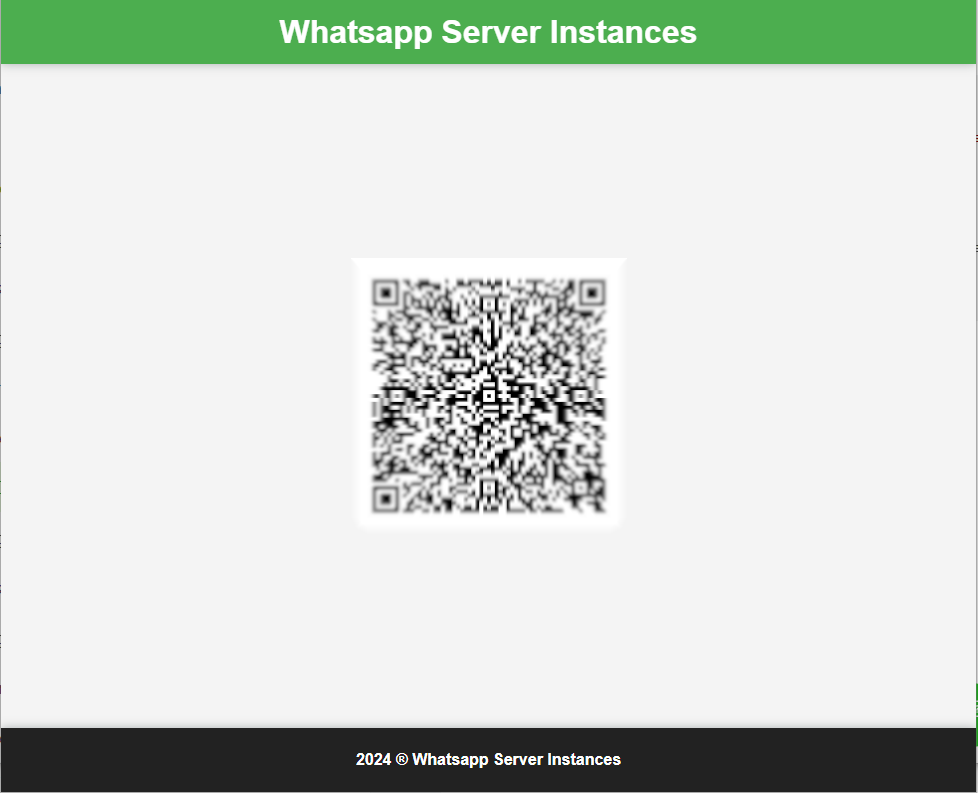

After the account link, you will notice that the instance is active by the green light in the instance header:
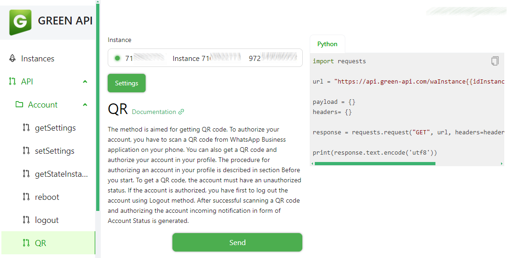


### Getting the Contacts and Groups
Before we can start messaging, we need to get the Contact/Group details. we can do it using Green API endpoint.
On the lef side, Under API --> Service methods, click on "getContacts" and then click "Send":
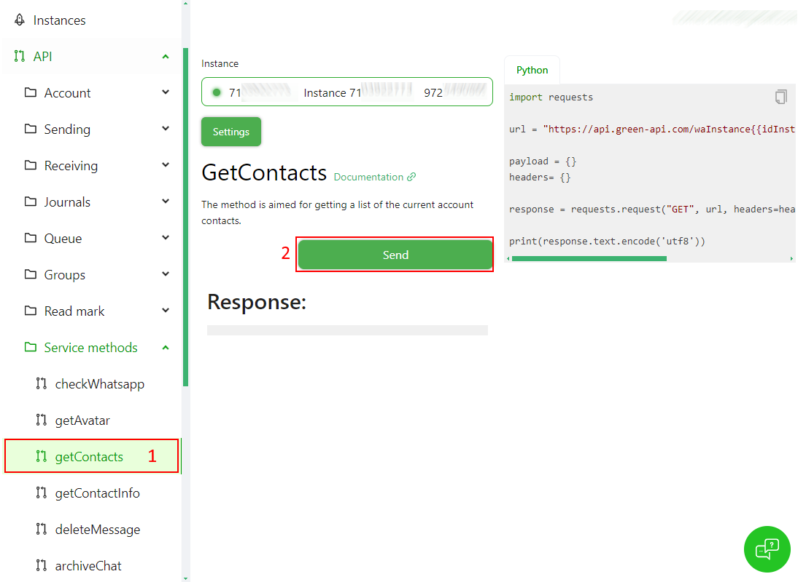

As a result, you will get the list of Contacts and Groups.
* The contact number ends with **@c.us**
* The group number ends with **@g.us**

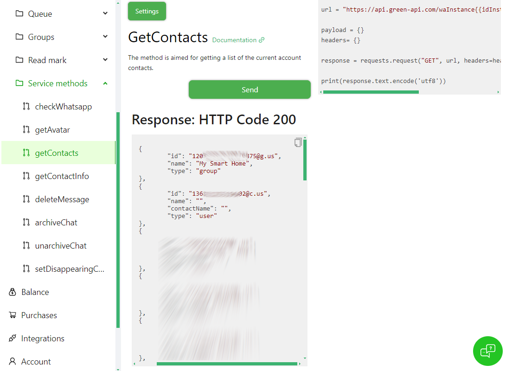

Write down the Id, you will need it to configure the notification.


### Setting up the notification in Home Assistant

Download the [green-api-custom-notifier](https://github.com/t0mer/green-api-custom-notifier), place it under the **custom_components** folder.
Restart Home Assistant and add the following section to your *configuration.yaml* file:


```yaml
notify:
  - platform: greenapi
    name: greenapi
    instance_id:  #REQUIRED: Set the instanceid
    token:  #REQUIRED: Set the greenapi token.
    target:  #OPTIONAL! Set the detault target. If you set the default target here, you won't have to specify it again in your service calls.
```

* instance_id is the Green API instance id.
* token is the Green API instance token.
* target is the chat/contact/group id to send the message to:
  * For groups, the id should end with *@g.us*
  * For chats, the id should end with *@c.us*


## Sending a message
To Send a message you call the service and provide the following parameters:
* message (**Required**): Test to send.
* title (**OPTIONAL**): Add a title for the message in **bold**.
* target (**OPTIONAL** if you've already defined the default target in your notify service, otherwise required): The chat/group id to send the message to.

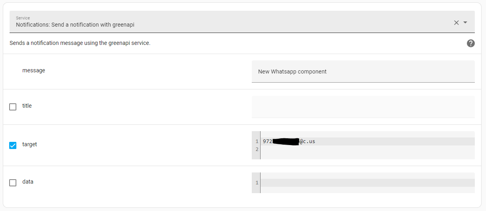

Or from Yaml mode:
```yaml
service: notify.greenapi
data:
  message: New Whatsapp component
  target: 972*********@c.us
```

### Optional - Attach media to message
To send message with media, add the following to the data parameter:
* file : [Path to the file]

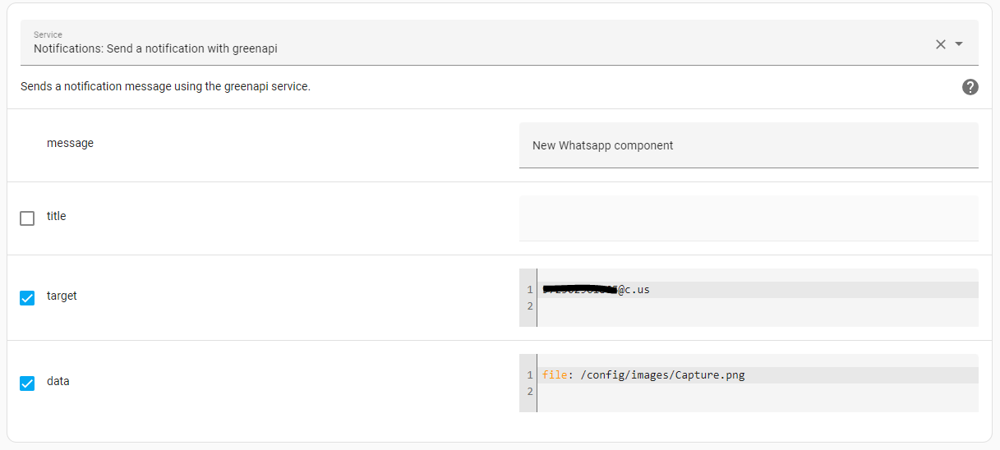

Or from Yaml mode:
```yaml
service: notify.greenapi
data:
  message: New Whatsapp component
  target: 972*********@c.us
  data:
    file: /config/images/Capture.png

```

# Important
### If the path to the file does not exist, the message will still be sent; but will log a warning.