# green-api-custom-notifier

[green-api](https://green-api.com/en) is a service that allows us to send and receive text, photo and video using stable WhatsApp API gateway. The service includes a free account that can be used to send notifications to 3 chats (Group or Private) and many more.

[green-api-custom-notifier](https://github.com/t0mer/green-api-custom-notifier) is a [Home Assistant](https://www.home-assistant.io/) custom notification component that enables sending notifications to WhatsApp groups and contacts using [green-api](https://green-api.com/en).


## Limitations
* The free account is limited to 3 chats (Group or Private).


## Getting started

### Setup Green API account
Navigate to [https://green-api.com/en](https://green-api.com/en) and register for a new account:
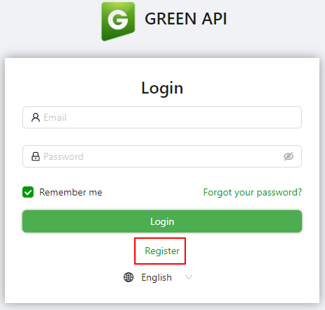

Fill up your details and click on **Register**:
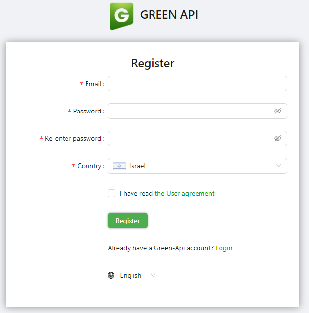


Next, click on the "Create an instance":
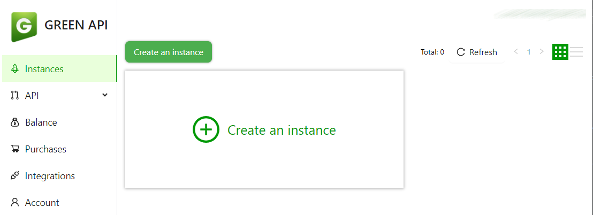


Select the "Developer" instance (Free):
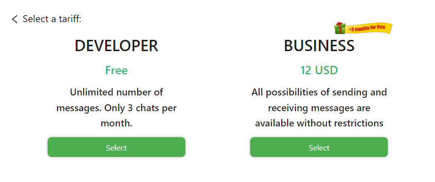


Copy the InstanceId and Token — you will need these during integration setup:
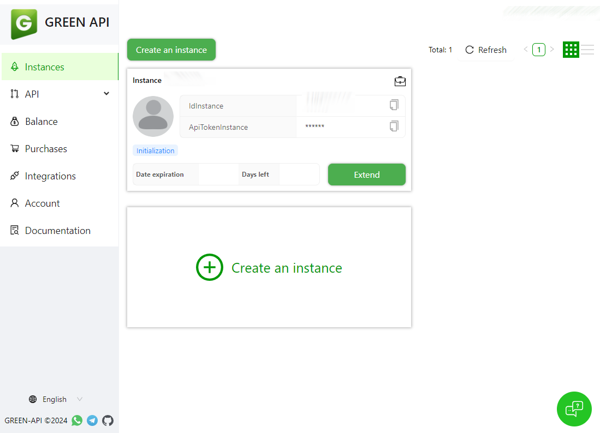

Next, connect your WhatsApp with Green API. On the left side, under API → Account, click on QR and copy the QR URL to the browser and click on "Scan QR code":

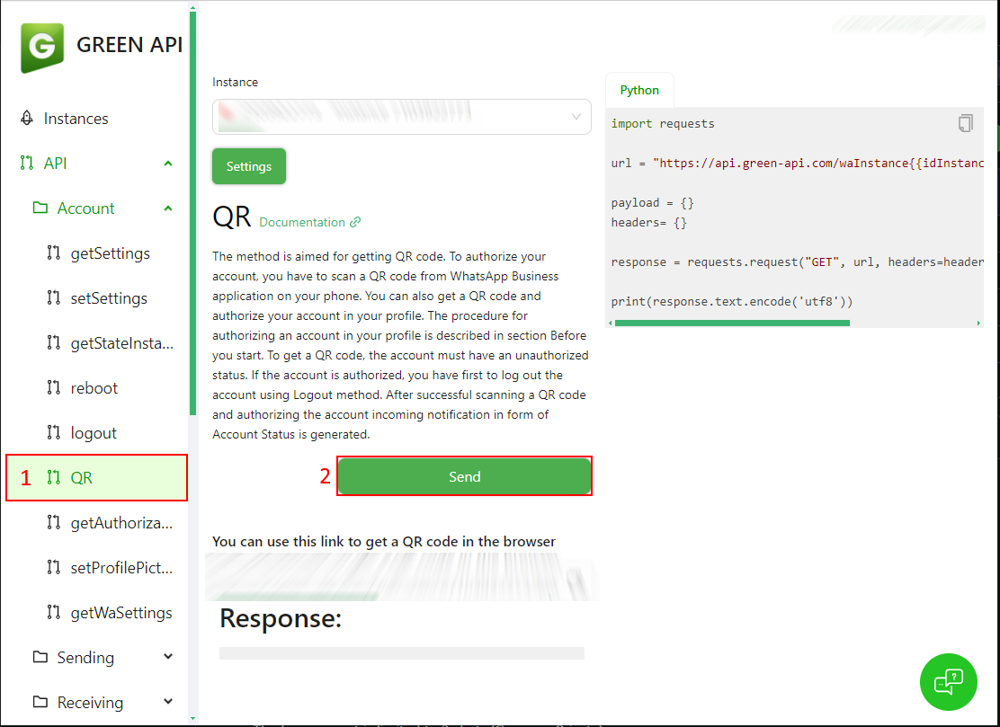

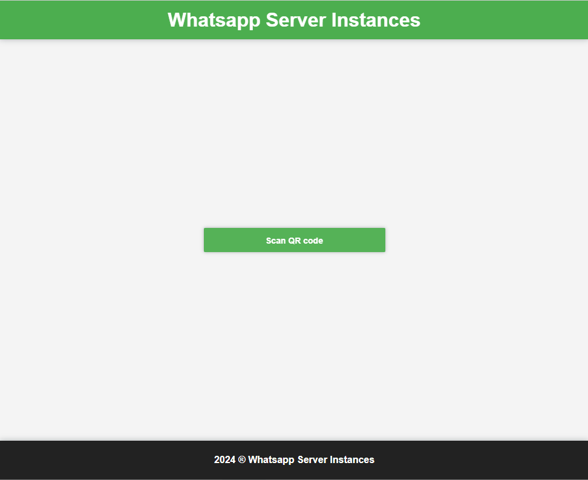

Scan the QR code to link your WhatsApp with Green API:

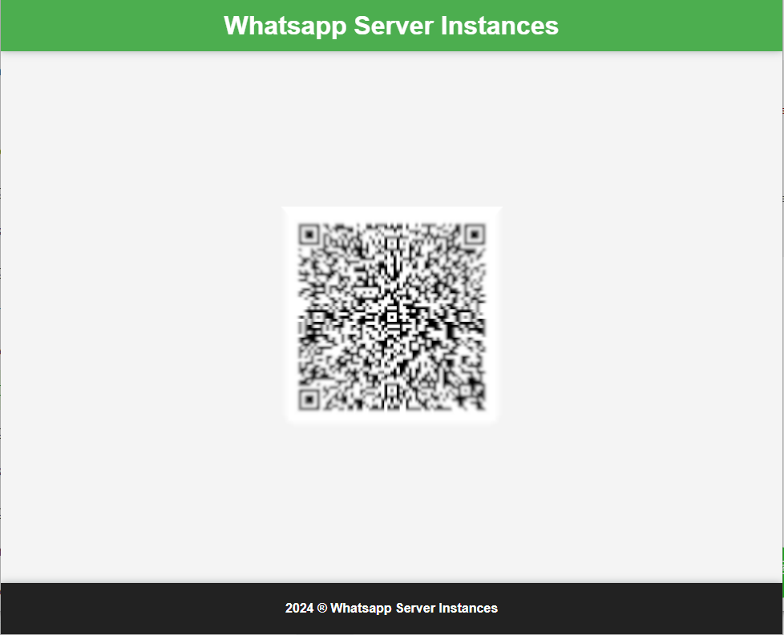

After linking, the instance will show as active with a green light in the instance header:
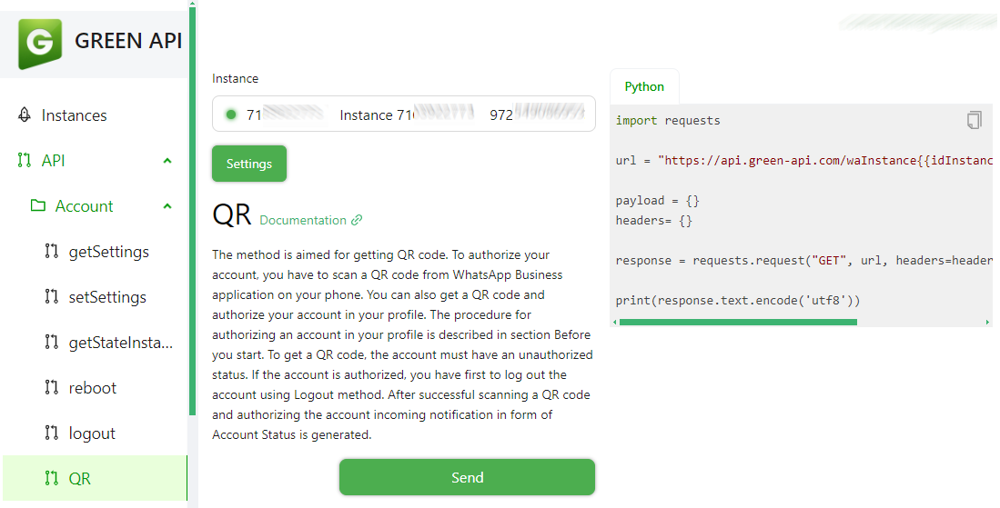


### Getting Contacts and Groups
Before messaging, get the Contact/Group IDs via the Green API endpoint.
On the left side, under API → Service methods, click on "getContacts" and then click "Send":
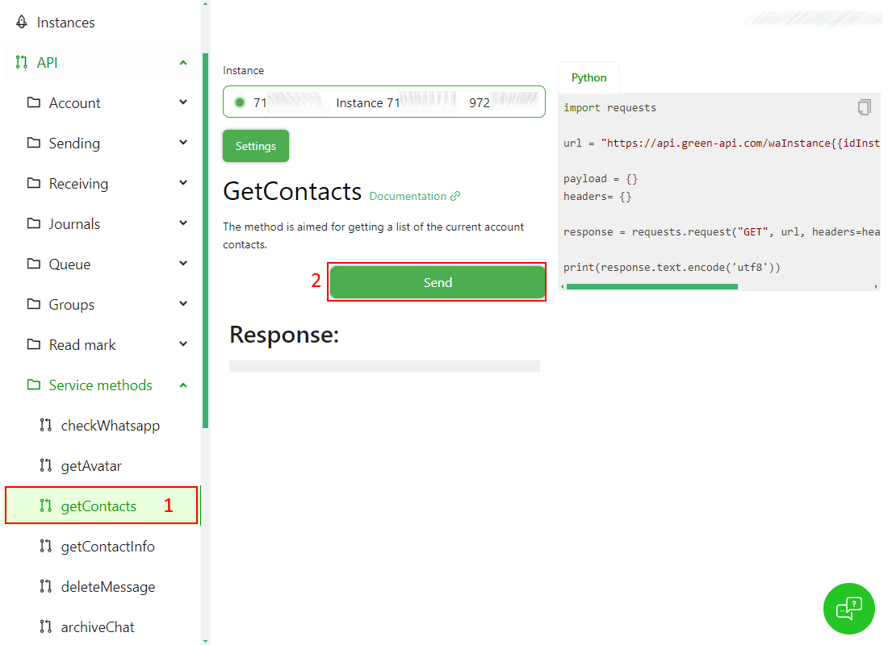

You will get a list of contacts and groups:
* Contact numbers end with **@c.us**
* Group numbers end with **@g.us**

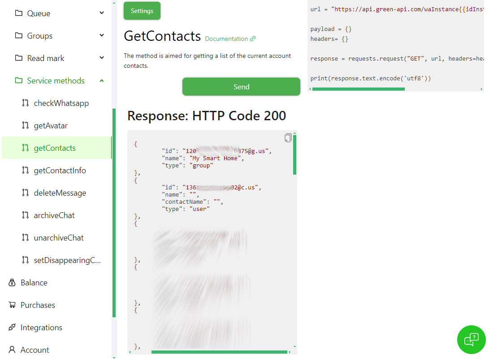

Note the ID — you will need it when sending notifications.


### Installing the integration

Download the [green-api-custom-notifier](https://github.com/t0mer/green-api-custom-notifier) and place the `greenapi` folder under your `custom_components` directory. Restart Home Assistant.

### Configuring via UI

Go to **Settings → Integrations → Add Integration** and search for **GreenAPI**. Fill in the three fields:

| Field | Description |
|-------|-------------|
| **Service Name** | A short friendly name (e.g. `home`). The notify service will be registered as `notify.greenapi_<name>`. |
| **Instance ID** | Your Green API Instance ID. |
| **Access Token** | Your Green API token. |

You can add multiple instances (e.g. for different WhatsApp accounts) — each gets its own uniquely named service.


## Sending a message

Call the service with the following parameters:

| Parameter | Required | Description |
|-----------|----------|-------------|
| `message` | Yes | Text to send. |
| `title` | No | Prepended to the message in **bold**. |
| `target` | Yes | The WhatsApp chat/group ID to send to. |

```yaml
action: notify.greenapi_home
data:
  message: Hello from Home Assistant
  target: 972XXXXXXXXX@c.us
```

With a title:
```yaml
action: notify.greenapi_home
data:
  message: Motion detected in the garden
  title: Security Alert
  target: 972XXXXXXXXX@c.us
```

For groups, the target ID ends with `@g.us`:
```yaml
action: notify.greenapi_home
data:
  message: Dinner is ready!
  target: 120363XXXXXXXXX@g.us
```


### Optional — Attach media to message

Add a `file` key inside the `data` field to attach a local file:

```yaml
action: notify.greenapi_home
data:
  message: Here is your image
  target: 972XXXXXXXXX@c.us
  data:
    file: /config/images/Capture.png
```

> **Note:** If the file path does not exist, the message is still sent as text and a warning is logged.
